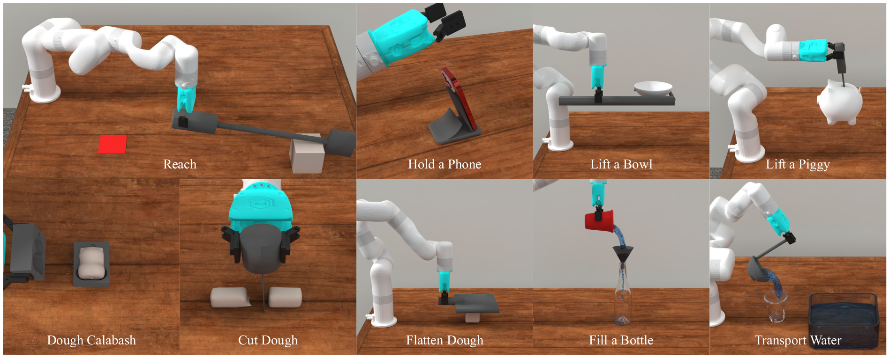

<p align="center">
  <h1 align="center">RobotSmith: Generative Robotic Tool Design for Acquisition of Complex Manipulation Skills</h1>
  <p align="center">
    NeurIPS 2025
  </p>
  <p align="center">
    <a href="https://chunru-lin.github.io/">Chunru Lin*</a>,
    <a href="https://github.com/dozingbear">Haotian Yuan*</a>,
    <a href="https://wangyian-me.github.io/">Yian Wang*</a>,
    <a href="https://openreview.net/profile?id=%7EXiaowen_Qiu1">Xiaowen Qiu</a>,
    <a href="https://zswang666.github.io/">Tsun-Hsuan Wang</a>,
  </p>
  <p align="center">
    <a href="https://www.minghaoguo.com/">Minghao Guo</a>,
    <a href="https://bohanwang123.com/">Bohan Wang</a>,
    <a href="https://research.nvidia.com/person/yashraj-narang">Yashraj Narang</a>,
    <a href="https://homes.cs.washington.edu/~fox/">Dieter Fox</a>,
    <a href="https://people.csail.mit.edu/ganchuang">Chuang Gan</a>
  </p>
  <p align="center">
    <a href="https://www.arxiv.org/abs/2506.14763">
      
    </a>
    <a href='https://umass-embodied-agi.github.io/RobotSmith/' style='padding-left: 0.5rem;'>
      
    </a>
    <!-- <a href='https://huggingface.co/anyeZHY/tesseract' style='padding-left: 0.5rem;'>
      
    </a> -->
  </p>
</p>

We propose RobotSmith, an automated pipeline that leverages the implicit physical knowledge embedded in vision-language models (VLMs) alongside the more accurate physics provided by physics simulations to design and use tools for robotic manipulation.




## Installation

```
git clone --recursive https://github.com/chunru-lin/RobotSmith.git
cd RobotSmith
```

Actually not from Genesis repo, edit later.

```
conda create -n roto python=3.9

conda install nvidia/label/cuda-11.8.0::cuda-toolkit
export CUDA_HOME=/home/xhrlyb/Apps/anaconda3/pkgs/cuda-toolkit-11.8.0-0

cd ext/Genesis/
pip install -e .
pip install torch torchvision torchaudio --index-url https://download.pytorch.org/whl/cu118

wget https://github.com/ompl/ompl/releases/download/prerelease/ompl-1.6.0-cp39-cp39-manylinux_2_28_x86_64.whl
pip install ompl-1.6.0-cp39-cp39-manylinux_2_28_x86_64.whl
rm ompl-1.6.0-cp39-cp39-manylinux_2_28_x86_64.whl
```

(Optional) Install [surface reconstruction](https://genesis-world.readthedocs.io/en/latest/user_guide/overview/installation.html#optional-motion-planning) and [raytracing renderer](https://genesis-world.readthedocs.io/en/latest/user_guide/overview/installation.html#optional-ray-tracing-renderer) following Genesis installation document for better visual quality.

```
pip install open-clip-torch
```

## User Guide

To use this project, first ensure your API keys are configured correctly: your OpenAI API key should be in api_keys.json and your Meshy API key in meshy_api_key.txt, both located at the project's root path.


### Step 1: Tool Design and Planning

This stage involves generating the tool and planning how it will be used. Execute the script below, substituting `{TASK_NAME}` with the name of your specific task. The script will use the task prompt located in the specified directory.

```
python utils/pipeline1.py --task_name {TASK_NAME} --task_prompt_json_dir {PROJECT_PATH_PREFIX}/RobotSmith/{TASK_NAME}/task_prompt.json
```

Choose from these tasks: `task01_calabash`, `task02_reaching`, `task03_flatten`, `task04_holder`, `task05_waterfill`, `task06_piggy`, `task07_lifting`, `task08_cutting`, `task09_transport`. 

### Optimization

After the initial design, you can optimize the tool's performance. The process varies based on the type of task:

- For tasks with only rigid bodies: Run the following command to generate the CMA-ES code:
```
python batch_generate_cmaes.py --root {TRIAL_NAME} --task {TASK_NAME}
```

- For tasks involving soft bodies and liquids: Execute the following script. 

```
python {TASK_NAME}/cmaes_tool_duplicate.py
```
The new folder including batched CMA-ES code for different tools will be create. 

## Citation

If you find our work useful, please consider citing:
```
@article{lin2025robotsmith,
  title={RobotSmith: Generative Robotic Tool Design for Acquisition of Complex Manipulation Skills},
  author={Lin, Chunru and Yuan, Haotian and Wang, Yian and Qiu, Xiaowen and Wang, Tsun-Hsuan and Guo, Minghao and Wang, Bohan and Narang, Yashraj and Fox, Dieter and Gan, Chuang},
  journal={arXiv preprint arXiv:2506.14763},
  year={2025}
}
```